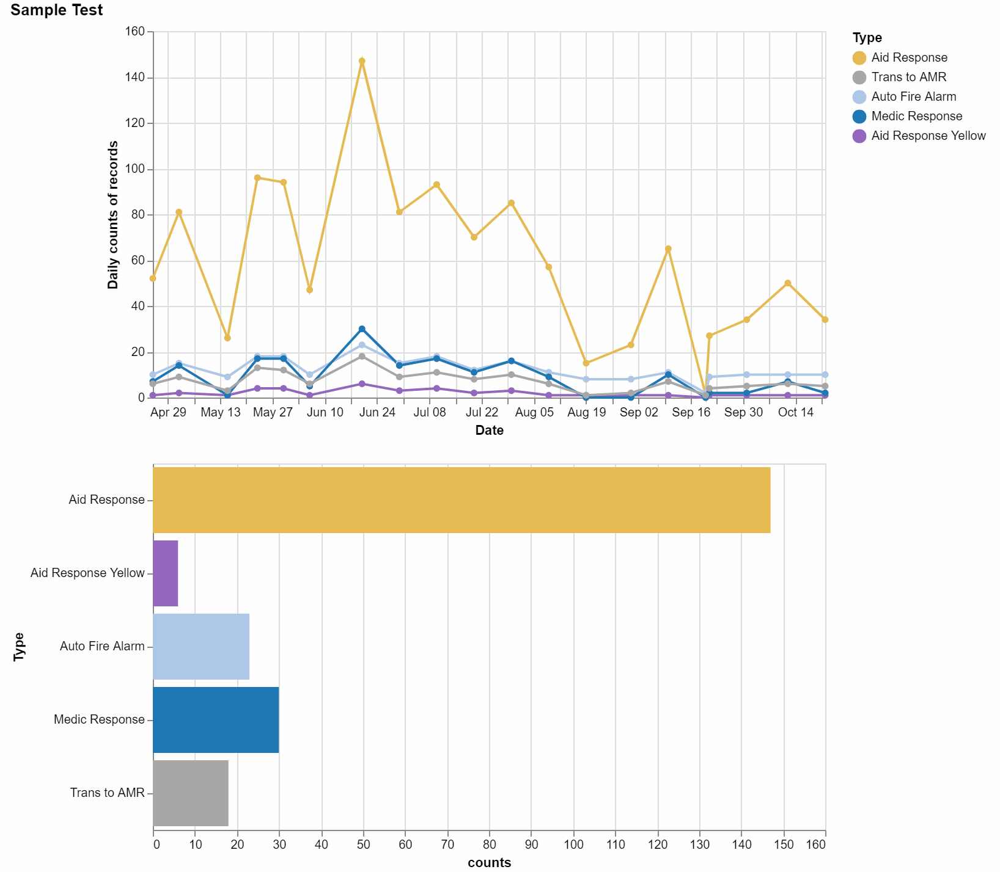

# 911CallsAnalysis

Runbang Tang, Xiaojing Xia, Nicolas Cardozo

This is a project to visualize and analyze the relationship between different types of 911 calls and Seattle location or weather information. The goal of this project is to help better deploy specific police forces to deal with corresponding cases according to 911 calls of different types' distribution across Seattle area.

Table of contents
=================

<!--ts-->
   * [Table of contents](#table-of-contents)
   * [Analysis](#analysis)
   * [Project Data](#project-data)
   * [Examples](#examples)
   * [Doc](#doc)
   * [Contributing](#contributing)
   * [License](#license)
<!--te-->

Analysis
================
This directory holds the code to prepare the data from multiple sources for analysis and analyze the data. It also contains the module files for data cleaning process and ipython notebook files to demonstrate functionality.

Project Data
=================
This directory holds the two data files used in the project. 

Examples
=================
This directory holds the file for the examples to show the potentail analysis that can be done by the analysis tools. It can serve as a user guide.

Doc
=================
This directory holds the presentation slides for the final project and also files that explained the detailed specification of the analysis tools.

Contributing
=================
Pull requests are welcome. For major changes, please open an issue first to discuss what you would like to change.

Please make sure to update tests as appropriate.

License
=================
[MIT](https://choosealicense.com/licenses/mit/)

